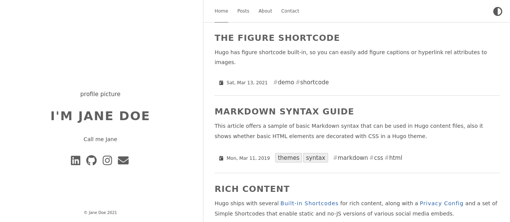
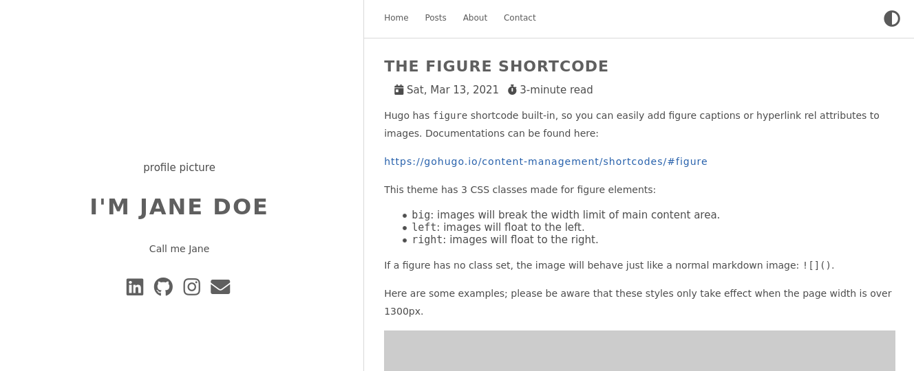
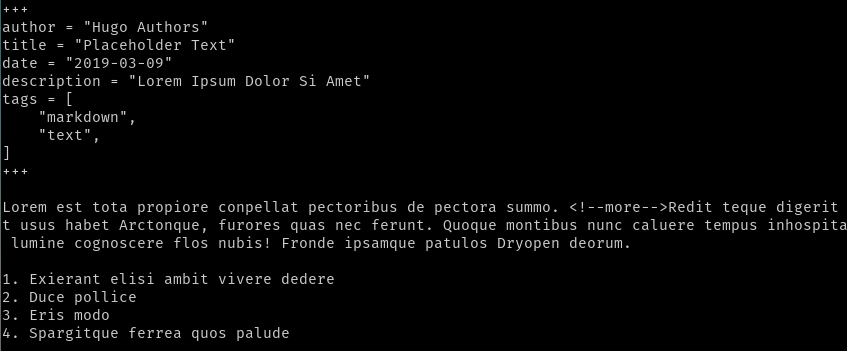

Adding or updating posts in Hugo is easy. After all, content management is one of the framework's primary features. My wife has little interest in understanding the software development side of blogging. Even she finds it effortless to add blog posts in markdown and half-a-dozen images per post through Github.  

## Directory structure
In Hugo, posts go into the **content** folder which will be in the root directory of your site. Some theme's may have varying patterns.

As shown below, create a **post** directory under the **content** directory.

    food-blog
      - archetypes
      - content
        - post
      - data
      - layouts
      - resources
      - static
      - themes
      config.toml

Navigate to the new **post** directory. Now copy the posts in Anatole's example site over to our newly created directory.

    cd content/post
    cp ../../themes/anatole/exampleSite/content/post/* .

Navigate back to the root directory of the Hugo site and start the Hugo server

    cd ../..
    hugo serve

If you open the site in a browser now, you will see that the posts you added have now been loaded!

If you click on a post, you will see what is called the **single** view in Hugo. You are seeing the entirely of the post you clicked on, as opposed to the list view which contains snippets of each post.

We have learned so far that you can add new posts to Hugo just by adding them to the **content/post** directory. Lets see what a post looks like in Anatole. Posts in other themes will be very similar. Below is the Markdown code for one of the posts in Anatole's example site.

The tags in the beginning such as **author** are self-explanatory. Try changing the values and seeing how the UI reacts. Text after the second **'+++'**, is the blog post's content in Markdown. I keep this [cheatsheet](https://www.markdownguide.org/basic-syntax/) handy for Markdown syntax.  

