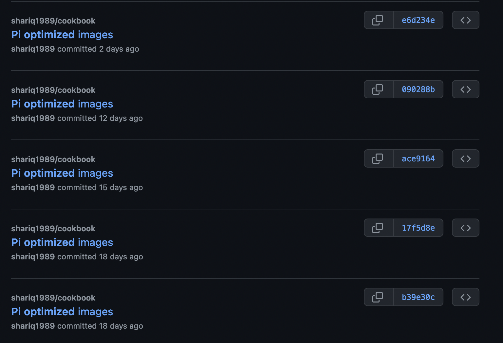
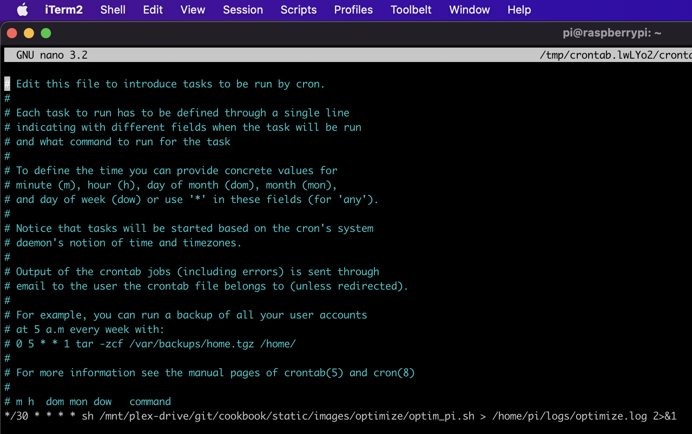
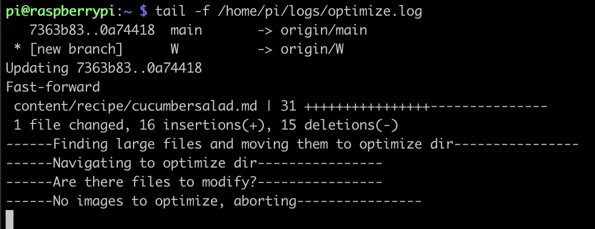

After [a]() [few]() 
[attempts](), I have automated the process for optimizing images for 
[JamilGhar](https://www.jamilghar.com). As my wife adds images to the project's git repository, a bash script that 
runs on regular intervals will compress them. The end result is fantastic because she no longer has to wait on me to 
manually optimize them for her and the Raspberry Pi that sits under my desk is being very useful. 

## Why is optimizing images important?
My wife takes high quality images for her food blog but displaying them on a website would slow down the loading process
considerably. Users and search engines expect websites to be snappy. There are ways to compress images by removing 
information from them without affecting them visibly, thereby improving user experience.   

## How do I compress images for the web?
I modified the original bash script so that it can run without human intervention. It pulls the latest 
changes in the repository and looks for large jpeg or jpg images. It then moves these images to a different folder for 
processing. The original image is backed up and then compressed/optimized using mogrify. The optimized images are moved
back to the original directory and the changes are pushed to the repository. 

I added an if-else check to ensure that the job would exit early if there were no candidate images found. 

    # This script optimizes and resizes any images in the optimize directory
    # navigate out to the images directory
    echo "------Navigating to images dir----------------"
    cd /mnt/plex-drive/git/cookbook/static/images/optimize
    git pull
    cd ..
    # move any JPG files larger than 1 MB to optimize dir
    echo "------Finding large files and moving them to optimize dir----------------"
    find . -maxdepth 1 -type f -size +1M -name "*.jp*g" -exec mv {} optimize/ \;
    # go back to optimize dir
    echo "------Navigating to optimize dir----------------"
    cd optimize/
    
    echo "------Are there files to modify?----------------"
    count=`ls -1 *.jp*g 2>/dev/null | wc -l`
    if [ $count != 0 ]
    then
        # backup images
        echo "------Yes, backing up large files----------------"
        find . -maxdepth 1 -type f -name "*.jp*g" -exec cp {} ../../backup/ \;
        # reduce size
        echo "------Using mogrify to resize----------------"
        mogrify -auto-orient -verbose -filter Triangle -define filter:support=2 -thumbnail 1200 -unsharp 0.25x0.08+8.3+0.045 -dither None -posterize 136 -quality 82 -define jpeg:fancy-upsampling=off -define png:compression-filter=5 -define png:compression-level=9 -define png:compression-strategy=1 -define png:exclude-chunk=all -interlace none -colorspace sRGB *.jp*g
        # move back to images dir
        echo "------Staging new images----------------"
        find . -maxdepth 1 -type f -name "*.jp*g" -exec mv {} ../ \;
        # push changes
        echo "------Pushing changes----------------"
        # navigate out to root directory
        cd ../../..
        git add *
        git commit -m "Pi optimized images"
        git push
    else
        echo "------No images to optimize, aborting----------------"
        fi 

## How do I schedule the bash script to run regularly?
Once the script was ready, I used crontab to run it every 30 minutes. Crontab is a file that contains instructions for 
the cron process. We can tell cron to run our script at any interval. Use the following command to edit the file

    crontab -e

You will see a file like the one below.

Add the following entry to the end of the file

    */30 * * * * sh /mnt/plex-drive/git/cookbook/static/images/optimize/optim_pi.sh > /home/pi/logs/optimize.log 2>&1

This will instruct cron to run the script every 30 minutes and to log the results in an optimize.log file. 

## How do I monitor a cron job?
You can now monitor log files to see if the script runs. You can change ***/30** to ***/5** for debugging so that the script 
runs every five minutes instead. 

You'll be able to see logged results in the file you set in the latter half of the cron instruction.

    tail -f /home/pi/logs/optimize.log

Tailing a command allows you to see additions to the file appear as they come in. So you can start tailing the log and 
wait for five minutes to see if something is logged. I could see that the script was running as expected in my case. 

