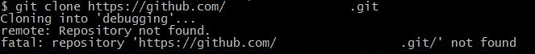
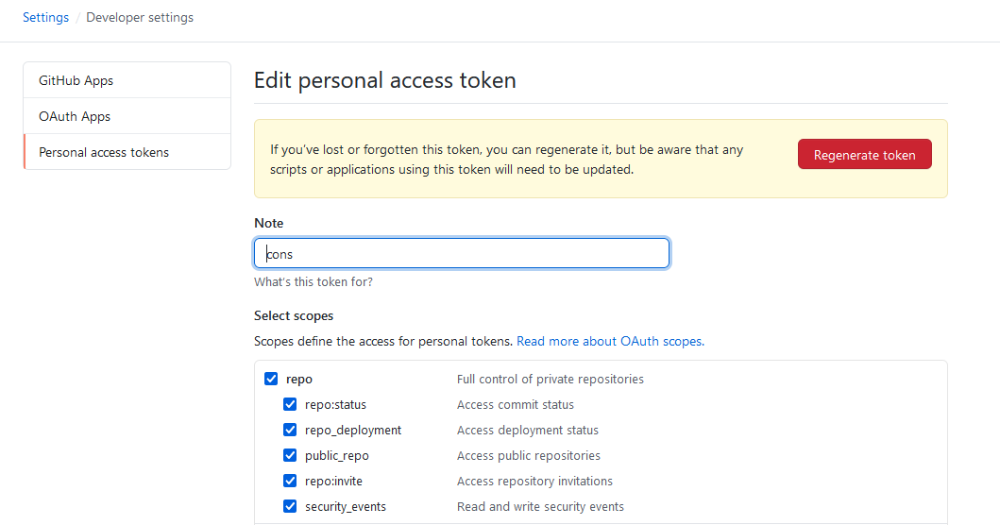

At my work we use Personal Access Tokens (PATs) to authenticate to a Github repository (as opposed to using a password).  I was having trouble cloning the repository and seeing the following error

After browsing Stack Overflow posts, I realized that I didn't set the right "scopes" or permissions for my token. I generated a new token but this time I made sure to set all the scopes under "repo". After setting the appropriate scopes, I was able to access the repository with the new token. 

