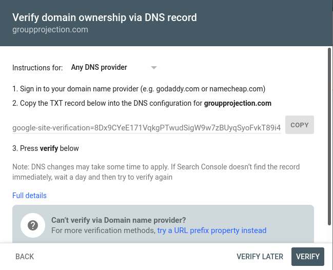
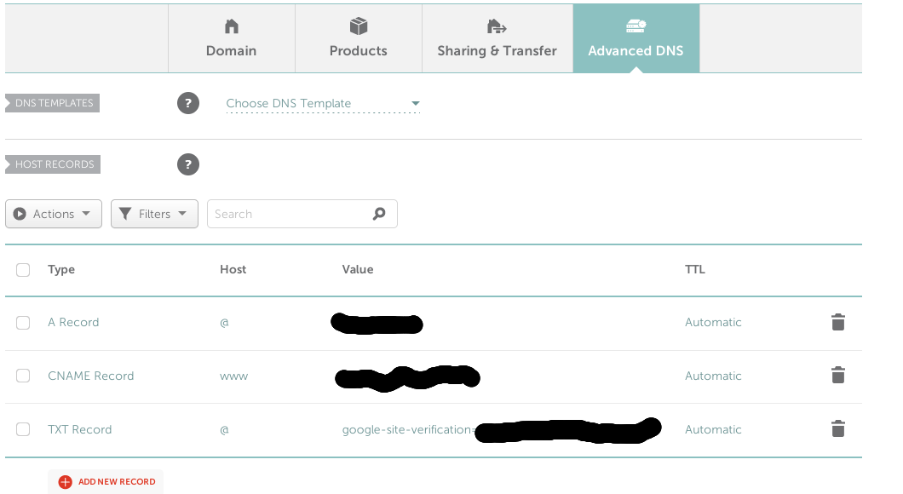

Google Search Console helps with understanding your website's performance on the search engine. To track a website there, you must first verify domain ownership using the form shown below.

The form asks us to add a **TXT record** for our URL. You'll need to update this through your domain management tool. Since I use Namecheap to manage my domains, I'll add the record there.

## Adding TXT record in Namecheap

To access DNS settings, you'll need to

- Hover over Account (top navigation bar) and click Dashboard
- Click manage on the right-hand side of the URL you intend on tracking
- Click **Advanced DNS**
- Click **Add a new record**
- As shown in the image below, select **TXT Record** in the first column for **Type**
- Add an **@** in the **Host** column
- Paste the Google verification code you can copy from the form in Google Search Console into the **Value** column
- Leave **TTL** set to **Automatic**

## Verification

Within moments, you can go back to the Google Search Console verification click **Verify**. The verification should succeed, and you can start tracking your website.
