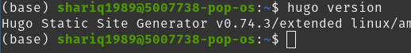

To begin working on the blog, I needed to install Hugo first. My laptop runs [Pop_OS!](https://pop.system76.com/), a Linux distribution based on **Ubuntu**. There are quite a few ways to install Hugo and I chose to install the official package using **apt-get**.

    sudo apt-get install hugo

Once the install was complete, I verified the install

    hugo version

As shown in the screenshot below, Hugo version 0.74.3 installed successfully on my machine.

