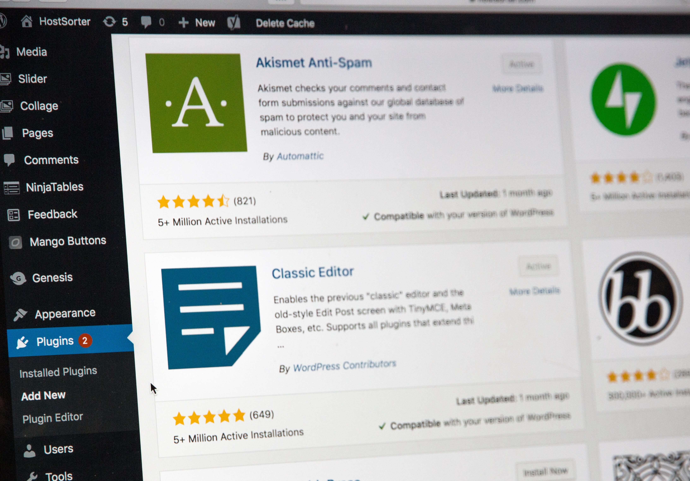
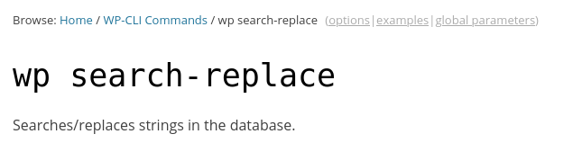
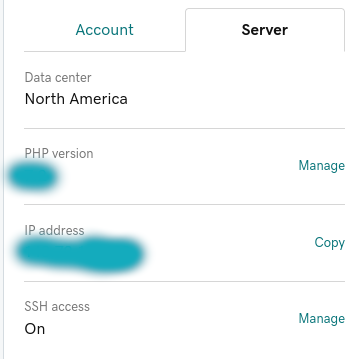
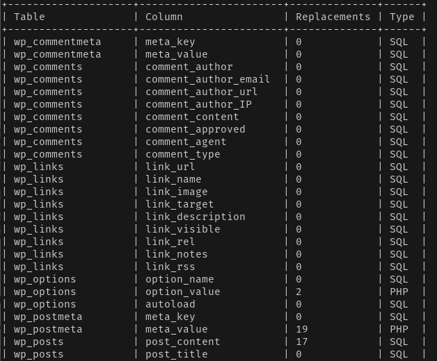

I help my dad maintain a WordPress site for his business. He recently opened a new location and needed a new WordPress site created for it. The only differences between the two sites are the branch name (ex. 'Los Angeles' instead of 'San Diego') and phone number ('111-222-3333' instead of '222-333-4444'). 

The site is not stored in version control so downloading the source code, using an IDE to run find/replace and pushing updates wasn't a straight-forward option. The tedious approach would be to update each reference on the site page by page in WordPress admin but that would take a long time and I would risk missing references or making mistakes. 

Thankfully, after researching this problem I ran into a brilliant solution: a WordPress CLI (command-line interface) command called **search-replace**. It can be run on the server where the application is deployed.  

    wp search-replace

Since I am comfortable with Linux, I decided to connect to the server from my machine and run the commands.  

As shown above, I first had to turn on SSH access with the web host and then create user credentials. I was then able to connect to the server using the following command

    ssh <user>@<ip address>
    # example
    ssh user123@192.168.1.1

After entering yes to the fingerprint prompt, I was free to use the WP CLI. To ensure that I was making the changes I intended to make, I used the **dry-run** option. Using single quotes around the terms allowed me to use spaces. The first term is the one being searched for and the second is the replacing term. So in this example, Los Angeles will be replacing any instances of San Diego. 

    wp search-replace 'San Diego' 'Los Angeles' --dry-run

As mentioned earlier, dry-run showed me that most of the changes will be in posts which is what I expected. 

I ran the command again but without the dry-run option. 
    
    wp search-replace 'San Diego' 'Los Angeles'

...and got an affirmative message. 

I was pleased to visit the website after and see that all the references to the previous branch name had been updated. Going forward, I intend on digging into **WordPress CLI** more because it seems to be a powerful and helpful tool. 