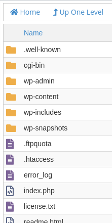
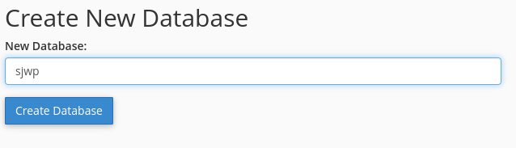
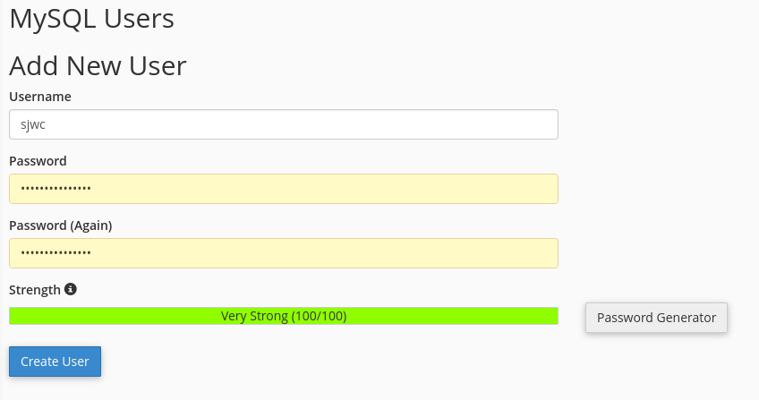
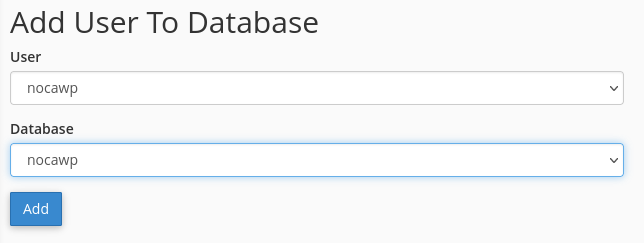
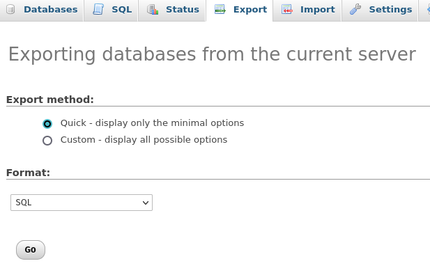
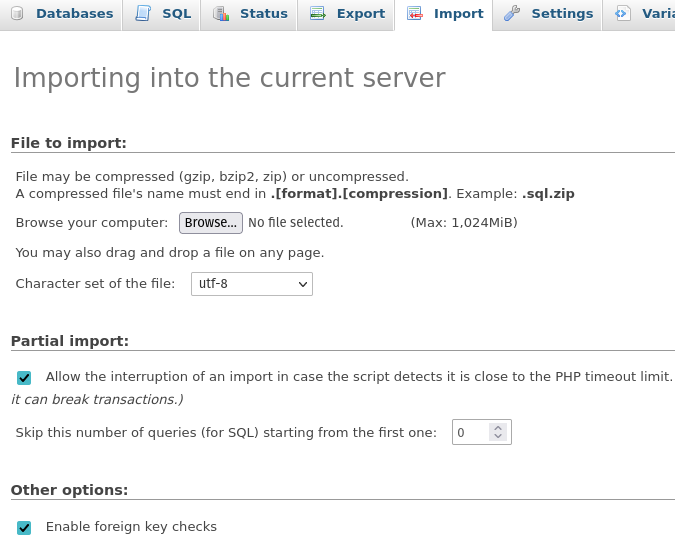

When my dad opened a new branch for his business, he opted for a new WordPress site which would be a copy of the site for the original location but with specific updated references like branch name, addresses and, phone numbers.

He uses GoDaddy as his host but this guide would apply to most web hosting solutions.

## Copying WordPress files

When migrating or copying your WordPress files, you will first need to navigate to your host's **File Manager** or **File Navigator**. As you can see below, GoDaddy provides the relevant tools right in their top navigation bar.

Once there, navigate to the **public_html** directory. If you have multiple projects in there, you'll want to enter into the specific project that you want to copy or migrate.

You'll know you are in the right directory when you see the files below

From here you can copy all your files to another instance with the same host or download them for deploying elsewhere. You can also use FileZilla (or similar FTP software) and connect to your host via FTP if you prefer and the host provides access (GoDaddy does).

## Update wp-config.php

You will need to set up another database to support the new application. Before you do that, update the config file while you are still looking at the files.

We will need to edit **wp-config.php** which is located in the directory we found in the previous step. If your host allows it, you may edit the file in the file manager. GoDaddy doesn't, so I had to download the file, updated it and then upload the new file.

The following lines will need to be updated.

- A database name. I use application initials followed by **wp**, ex. **sjwp**. This has to be unique.

      /** The name of the database for WordPress */
      define('DB_NAME', 'NEW_DB_NAME');

- A user name. I keep this the same as the db name. Ex. **sjwp**. This has to be unique.

      /** MySQL database username */
      define('DB_USER', 'NEW_USR_NAME');

- A password. I use a password manager to generate a long secure password.

      /** MySQL database password */
      define('DB_PASSWORD', "NEW_PASSWD");

- Lastly, navigate to the following link to get a newly generated set of security keys and then overwrite the same section in the file. 

   https://api.wordpress.org/secret-key/1.1/salt/ 

## Create database
The last step is to provision a database and user corresponding to the values you set in the previous step. In GoDaddy, this is done through the **MySQL Databases** option in **CPanel**. Your host may use a different interface for working with databases.

Creating a new database using the interface is straightforward. Just remember to enter the database name you set in the previous section. 

Next, you'll create a user (use the same values you set in the previous section). 

Lastly, we will associate the newly created database and user. 

And that's it, your new WordPress instance has everything it needs

- A database and user
- WordPress files

Once you resolve the DNS settings, you can access the URL endpoint and go through installing the new instance. 

## Copying a WordPress database

I had a scenario in which I needed the new site to have the same data as the previous one. You may need this functionality if you are migrating to a different host. This is performed in GoDaddy through **phpMyAdmin**. 

The first step is to export the old database by clicking **Export** in the navigation bar and then using the default options. Clicking **Go** will trigger the download of an SQL file. 

Lastly, you can import the exported SQL into the empty database we created earlier.

