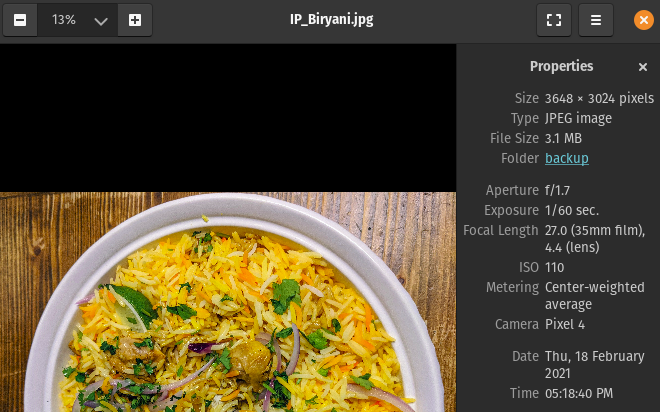
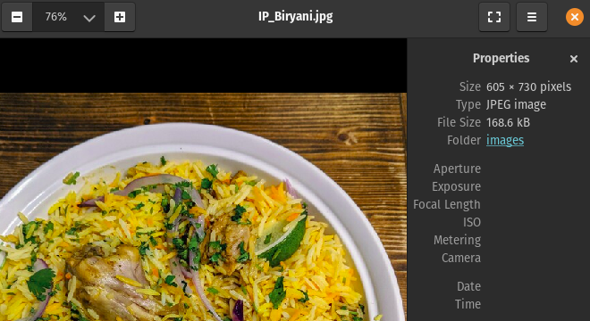

When we first started adding photos of food to [JamilGhar](https://www.jamilghar.com), we did not think about image size. The average image we posted to the blog was between 2 and 8 megabytes and the resolution was over 3000 x 3000 pixels. The image below is an example.

For most blogs, images should be less than 1000 pixels in the longest direction and preferably less than 100 kB. Featured or "hero" images can be up to 500 kB if used sparingly. 

## Image optimization research

There are many ways to reduce the size of an image

- Within image editing software (Paint, GIMP, Photoshop, etc.) 
- Using [online utilities](https://www.reduceimages.com/)
- Using command-line utilities (jpegoptim, optipng)

The first two options seemed tedious because they are hard to automate. Using command-line to resize an image means that I can write a bash script that can process a large number of images with the same number of clicks.

## Command-line utilities

### [jpegoptim](https://github.com/tjko/jpegoptim)

This is a popular online utility for optimizing and compressing JPEG files. It is capable of accepting multiple images at a time. Below are two important commands for our use-case.

Optimize JPEG images, stripping all non-essential data

    jpegoptim --strip-all image1.jpeg image2.jpeg

Reduce to a specified size

    jpegoptim --size=250k image1.jpeg image2.jpeg imageN.jpeg

### [mogrify](https://imagemagick.org/script/mogrify.php)

This utility is similar to jpegoptim and can be used for resizing, cropping, blurring or flipping images. Here is the command for resizing an image by 50%. 

    magick mogrify -resize 50% rose.jpg

## A script for optimizing images for blogging

As mentioned in previous posts, my wife is responsible for adding content, and I focus on meeting any technical needs. When adding a new recipe, she will upload 5-10 photos to the GitHub repository. Once or twice a week, I inspect the "images" directory for any files over 1 MB. New image files that she uploads are greater than that limit as shown in the image at the beginning of this post. 

I needed a script that would back up the original image, optimize and resize, and then place the newly generated image in the appropriate **static/images** directory. After processing, the backed-up original images and the processed versions would be pushed to the Git repository. Voilà! A bash script called **optimize** was born.

The directory structure of JamilGhar's image files is as follows. Any images that display on the blog are stored in the **images** directory. The original versions of these images are stored in the **backup** directory. Before running the optimize script, candidate images for resizing are moved to the **optimize** directory. 

    - static
      - backup
      - images
        - optimize

Once large images (> 1 MB) have been moved to the optimize directory, the script is run. It will store a copy of the original image in the backup directory

    # backup images
    cp *.jpg ../../backup/

Use jpegoptim to remove metadata and mogrify to reduce image size by 80%.

    # remove file data, optimize file to reduce space
    jpegoptim *.jpg --strip-all
    # reduce size
    mogrify -resize 20% *.jpg

Move the newly generated image back to the images directory.

    # move back to images dir
    mv *.jpg ../

Push the backed-up files and processed copies to the GitHub repository. 

    # push changes
    echo "------Pushing changes----------------"
    # navigate out to root directory
    cd ../../..
    git add *
    git commit -m "optimized images"
    git push

## The Result

The image below is a resized version of the one at the beginning of this post. The resolution is decreased to a third of the original value without sacrificing much quality. The size decreased by a staggering 94.7%! The script allows us to resize any number of images with the same effort. 

## Future Considerations

Moving the image files to the optimize directory is still a manual step. I did this to ensure that I got to have the final say on which images are adjusted. This is at the cost of having huge images on the website until I get a chance to resize them. I believe this flow could be improved and fully automated by hooking into a GitHub Action or Netlify's continuous integration flow. It also only handles JPG files at the moment so extending the script to handle PNGs and GIFs would be beneficial.