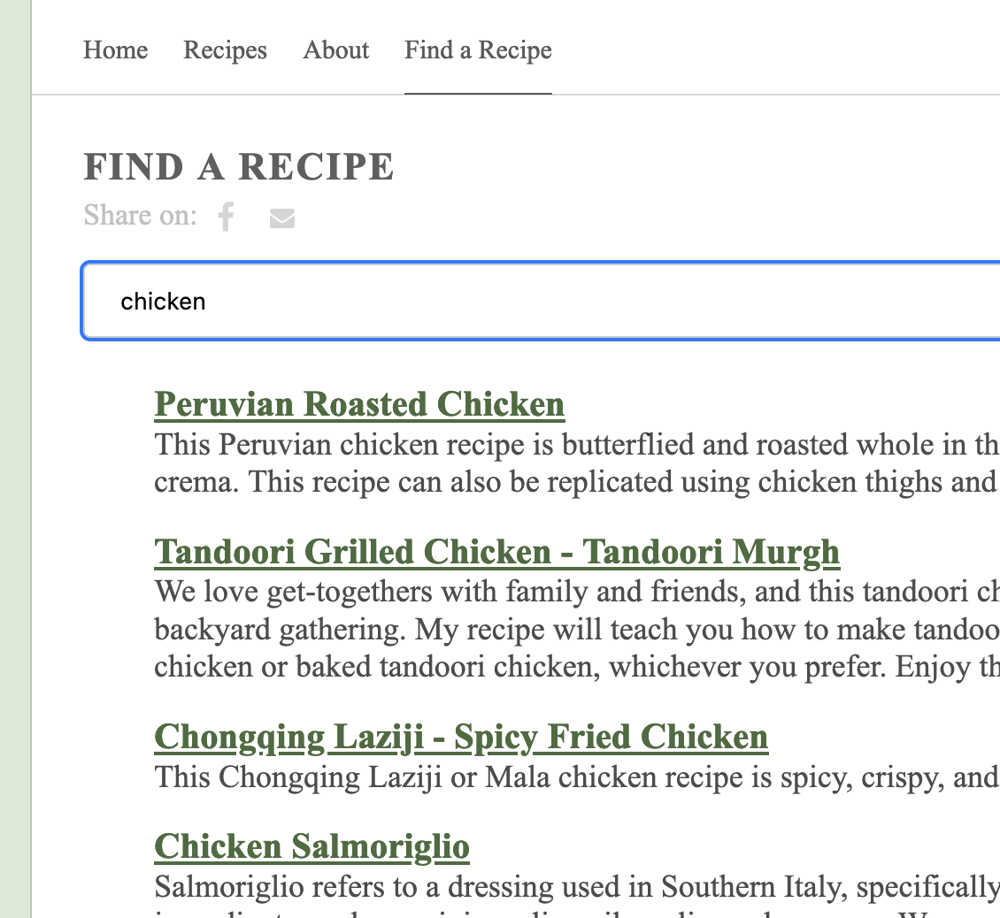

Search is an important functionality for any content heavy website. Our decision to use a static site for our 
[recipe blog](http://www.jamilghar.com) meant that adding complex features that involve server operations would be difficult to implement without relying on 
third-party tools. These features include comments and custom metric tracking. 

Luckily, this problem has been solved by a Javascript library called [Lunr.js](https://lunrjs.com/). Lunr provides a 
fast search experience for the user by processing JSON documents produced by static site generators like Hugo. The image 
above shows the JamilGhar's [search functionality](https://www.jamilghar.com/search/) in action. 

## Add a search page
Inside the **content** folder, add a new file called **search.md**. Paste the following content and update the relevant
fields. 

    +++ title = "Find a page" date = "2020-11-12" aliases = ["search"] author = "Author Name" +++
    

The second line will import a shortcode called searchpage.html, so let's create that next. 

## Create search shortcode

Inside the **layouts** directory, create a **shortcodes** directory if it doesn't exist already. Inside **shortcodes**,
create a new file called **searchpage.html**.

The path to your new file should look like:

    {{project directory}}/layouts/shortcodes/searchpage.html

Paste the following snippet inside **searchpage.html**

    
    
    
    

        <input id="search-input" type="text" placeholder="What are you looking for?" name="search-input"
               class="form-control">
    

    

The page is fairly straightforward. We start by importing Lunr.js and a javascript file we will import next. After that 
we create a text input box where the user will enter search terms. There is no submit button here because the javascript
function will trigger searches automatically on each keystroke. 

## Create search javascript file

Inside the **static** folder, create a **js** folder if it doesn't exist already. Create **search.js** inside the **js**
directory. 

I relied on [Matt Walters' implementation of search in Hugo](https://www.mattwalters.net/posts/2018-03-28-hugo-and-lunr/)
for the Javascript portion. You'll have to change the logic as needed based on your needs. 
    
    var idx = null;         // Lunr index
    var resultDetails = []; // Will hold the data for the search results (titles and summaries)
    var $searchResults;     // The element on the page holding search results
    var $searchInput;       // The search box element
    
    window.onload = function () {
    // Set up for an Ajax call to request the JSON data file that is created by
    // Hugo's build process, with the template we added above
    var request = new XMLHttpRequest();
    var query = '';
    
        // Get dom objects for the elements we'll be interacting with
        $searchResults = document.getElementById('search-results');
        $searchInput = document.getElementById('search-input');
    
        request.overrideMimeType("application/json");
        request.open("GET", "/index.json", true); // Request the JSON file created during build
        request.onload = function () {
            if (request.status >= 200 && request.status < 400) {
                // Success response received in requesting the index.json file
                var documents = JSON.parse(request.responseText);
    
                // Build the index so Lunr can search it.  The `ref` field will hold the URL
                // to the page/post.  title, excerpt, and body will be fields searched.
                idx = lunr(function () {
                    this.ref('title');
                    this.field('description');
                    this.field('href');
    
                    // Loop through all the items in the JSON file and add them to the index
                    // so they can be searched.
                    documents.forEach(function (doc) {
                        this.add(doc);
                        resultDetails[doc.title] = {
                            'href': doc.href,
                            'description': doc.description,
                        };
                    }, this);
                });
            } else {
                $searchResults.innerHTML = 'Error loading search results';
            }
        };
    
        request.onerror = function () {
            $searchResults.innerHTML = 'Error loading search results';
        };
    
        // Send the request to load the JSON
        request.send();
    
        // Register handler for the search input field
        registerSearchHandler();
    };
    
    function registerSearchHandler() {
    $searchInput.oninput = function (event) {
    var query = event.target.value;
    var results = search(query);  // Perform the search
    
            // Render search results
            renderSearchResults(results);
    
            // Remove search results if the user empties the search phrase input field
            if ($searchInput.value == '') {
                $searchResults.innerHTML = '';
            }
        }
    }
    
    function renderSearchResults(results) {
    // Create a list of results
    var ul = document.createElement('ul');
    if (results.length > 0) {
    results.forEach(function (result) {
    // Create result item
    var p = document.createElement('p');
    p.innerHTML = '<a style="color:#486b3d;font-weight: bolder;font-size: larger;" href="' + resultDetails[result.ref].href + '">' + result.ref + '</a> ' +
    '' + resultDetails[result.ref].description + '';
    ul.appendChild(p);
    });
    
            // Remove any existing content so results aren't continually added as the user types
            while ($searchResults.hasChildNodes()) {
                $searchResults.removeChild(
                    $searchResults.lastChild
                );
            }
        } else {
            $searchResults.innerHTML = 'No results found';
        }
    
        // Render the list
        $searchResults.appendChild(ul);
    }
    
    function search(query) {
    return idx.search(query);
    }

The code is well documented and self-explanatory. It calls Lunr with the search term entered by the user and the raw data
that the search will be performed against. 

## Prepare JSON files
For static sites, search is performed by parsing page content in JSON. We'll start by exporting our pages using Hugo's 
built-in data templates. Most theme's support this functionality out of the box. You can find this by searching for 
"outputs" in the **config.yaml** file. You will need to add "JSON" to the outputs list. 

The README for your chosen theme should also have notes on implementing search or exporting JSON. 

For the two themes that I use, adding JSON looked like

    [outputs]
    home = ["HTML", "RSS", "JSON"]

and 

    outputs:
    home:
      - HTML
      - RSS
      - JSON # is necessary
