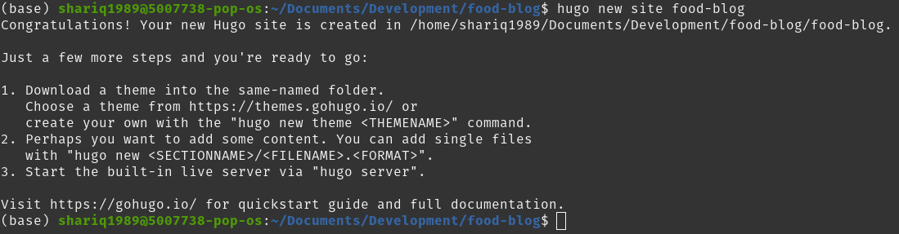
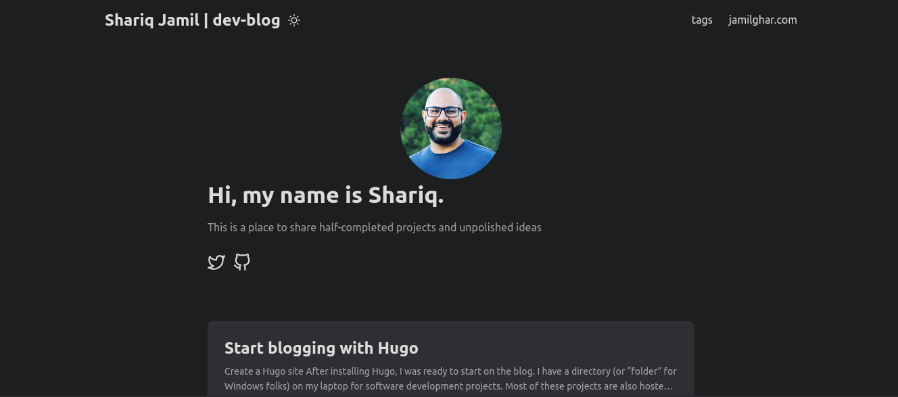
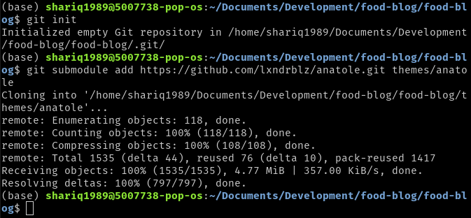
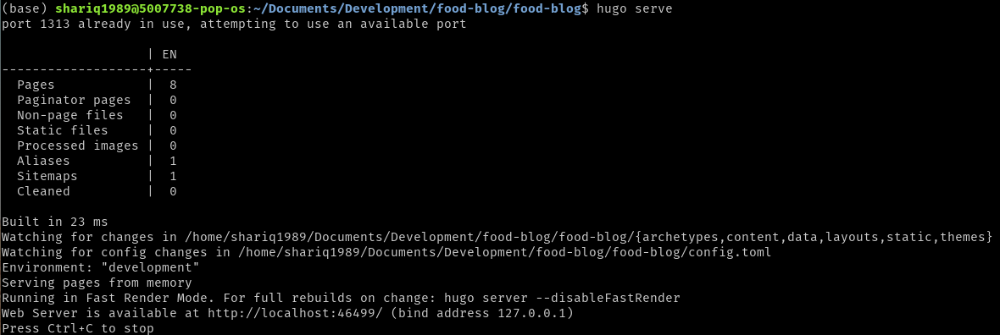
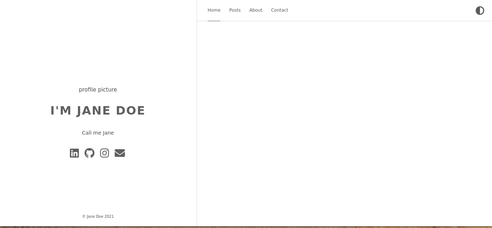

## Create a Hugo site

After installing Hugo, I was ready to start on the blog. I have a directory (or "folder" for Windows folks) on my laptop for software development projects. Most of these projects are also hosted in my [Github](https://github.com/shariq1989) account. 

I navigated to that directory and created a folder called **food-blog**. Inside **food-blog**, I ran Hugo's command to start a new site.

    hugo new site food-blog

In the screenshot below, you can see that the new Hugo site was created successfully. 

You may wonder why I created the Hugo site inside a directory with the same name (**food-blog/food-blog**). This is because I like to store files that I do not want to check in to version control in this root directory. If you want to avoid this pattern, you can have these files in the Hugo site root and added to the **.gitignore** file.  

# Choose a Theme

As suggested by Hugo when you created the new site, you may now look for and implement a theme. Hugo has an [extensive collection of themes](https://themes.gohugo.io/) available for free. Each will have its own set of instructions for setup and configuration. Not all themes offer the same features, so it is good to think about the functionality you need in your site. Other factors I consider when choosing a theme are
- Number of stars on Github
- Open issues on Github
- Time since the last commit
- Testing/QA

These factors will indicate how well-maintained the theme is. If you have an issue down the road, you will want the theme's maintainer to be engaged. The number of stars shows the theme's popularity - if it's used enough, chances are that quite a few issues have already been addressed and that there is a larger pool of contributors. Testing/QA helps ensure that new commits do not include vulnerabilities and do not break existing functionality.

Two well-supported and feature-rich themes that I like are [Anatole](https://themes.gohugo.io/anatole/) and [PaperMod](https://themes.gohugo.io/hugo-papermod/). You can make changes to a theme to support your use-case, so it's fine to choose a theme that loosely provides the structure you want.

## Install the Theme
To begin installing the theme, navigate to the newly created Hugo site's root directory. Now you can initialize the Git repository here and pull down the theme as a submodule.

A Git submodule allows you to pull a separate repository into a project - which is a great model for importing libraries. A theme in Hugo is similar to importing a library.  

    git init
    git submodule add https://github.com/lxndrblz/anatole.git themes/anatole

The submodule has now been downloaded and is ready for configuration.

## Configuring the Theme

Themes can vary in how they are configured. You will need to read through these settings in the theme's documentation (often found in the theme's Github README). Anatole's maintainer did a [great job describing the setup process](https://github.com/lxndrblz/anatole#modifying-the-configtoml). 

Themes are mainly configured by updating the **config.toml** or **config.yml** file located in the root directory. You may often find a [sample config file](https://github.com/lxndrblz/anatole/blob/master/exampleSite/config.toml) in the theme's repository. You can compare the contents of this file to the [demo site](https://themes.gohugo.io/theme/anatole/) to learn more about the way the theme works.

I overwrote the default Hugo config file with the one provided in Anatole's repository. 

    mv themes/anatole/exampleSite/config.toml .

Feel free to personalize the information in this file before moving onto the next step.

## Build and Launch!

Run the following command in the Hugo site's base directory to build and run the site locally.

    hugo serve

In the output, you'll see a path http://localhost:1313. Click the URL or paste it into your browser to view your site.

The images do not appear because they do not exist in your Hugo project. You will have to add your own. At this point, you can start adding posts or customizing the site.