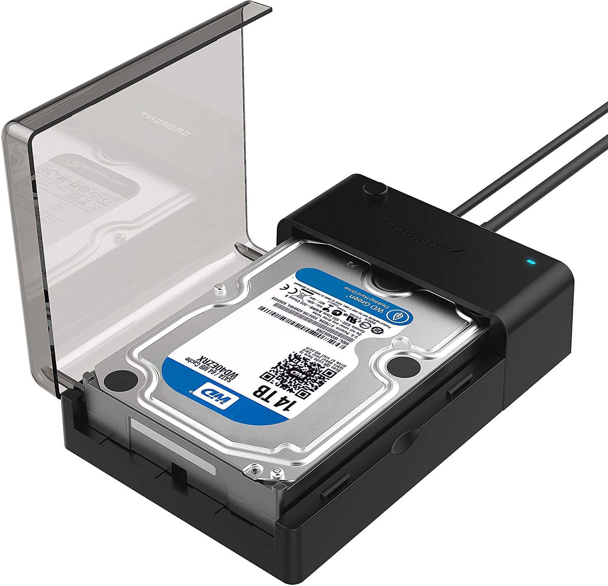
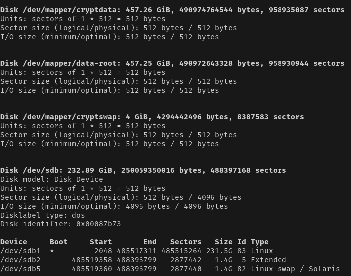
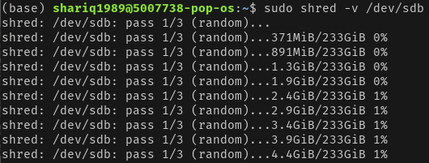
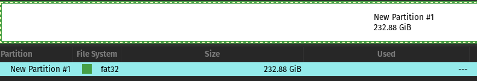

Over the years I have ended up with roughly a half dozen computers in various stages of decay. Two water-damaged Macbooks. An old HP laptop my dad handed down to me to "make faster and find a home for". A gaming desktop from college that was caked in dust and shorted when powered up ten years later. One task I had to perform for all these machines was to collect and remove any personal data from internal storage (hard drives/solid-state drives). 

## Apparatus
I am a fan of Sabrent's external hard drive enclosures have used them for years. I have had one connected to a Raspberry Pi that serves as part of a media server solution and lives in a closet. I have not had to touch the enclosure in three years now, so it's very reliable. 

I like that it can be used with 2.5-inch drives or the larger 3.5-inch ones as well. Since solid-state drives (SSDs) and hard disk drives (HDDs) both use SATA connections, the Sabrent enclosure will work with either type of drive. I did have to buy another [enclosure that supports the PCI-E interface](https://amzn.to/3tczE0g) to read Macbook SSDs. Please use the link below to purchase if you'd like to support this blog. 

[**Sabrent 2.5/3.5 inch External HDD/SDD Enclosure**](https://amzn.to/3da93v0)

## Wiping the drives
Once the drive is in the enclosure and connected to my Pop!_OS laptop, I am ready to begin the wiping process. 

I first ran the following command to find the name of the drive on my machine. 

    sudo fdisk -l

It was very important to correctly identify the drive you want to erase, or you'll accidentally wipe one of the drives connected internally to your machine. I know that my internal drive has a capacity of 500 GB whereas the drive I want to erase is 250 GB. The identifier for this drive is **/dev/sdb**. 

Next, I unmounted any partitions on the drive that are mounted on my computer. In the screenshot above, "/dev/sdb" refer to the drive and "/dev/sdb1" and "/dev/sdb2" refer to partitions. Note that the command to unmount a partition is **umount** and not **unmount**.

    sudo umount /dev/sdb1
    sudo umount /dev/sdb2

Once the partitions are unmounted, I could start erasing the data. This is performed by writing "junk" data on the disk repeatedly. This will ideally prevent data recovery methods from recovering our erased personal data. The shred command used below begins the writing process and will write over the entire disk three times. The **-v** or verbose flag will display write progress as the command runs. 

    sudo shred -v /dev/sdb

If successful, you will start seeing the command begin to write as shown below. It took a couple of hours for the three passes to complete on my laptop 

Once complete, if you run the **fdisk** command from earlier now, you'll see that the partitions on that drive are now gone. To create new partitions, I needed to install **gparted**.

    sudo apt-get install gparted

Once installed, I started gparted using the Applications menu. I clicked the drop-down menu in the upper-right corner of the page and selected "/dev/sdb (232 GB)". It displayed as entirely "unallocated". 

Now you are ready to partition the drive. Use **Device -> Create Partition Table...** to begin. You will see a scary prompt mentioning that any data on this drive will be erased. Ensure that this is the drive you want to wipe before continuing. 

Once complete, use **Partition -> New** and then select the format of the partition you want (I use fat32) before kicking off the partitioning. Click the green checkmark and then set the file system you want. I use fat32 for Windows and ext4 for Linux disks. You can always change the file system later.  

And there we are! The drive has now been written on three times over, formatted and then partitioned properly. The drive can now be sold separately or go back into its mothership. 

